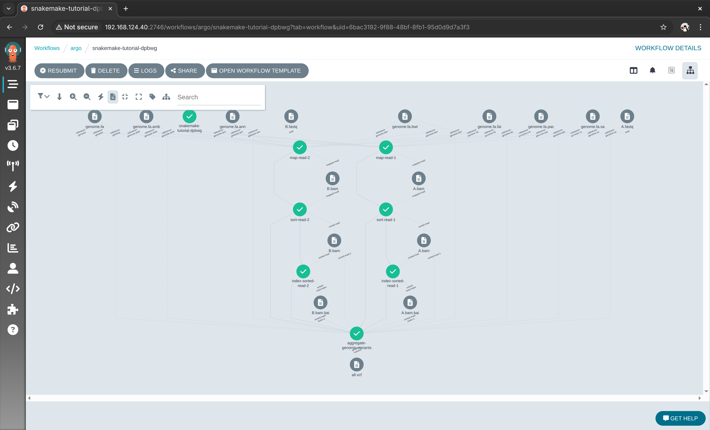

# snakemake-tutorial-argo-workflows

My adaptation of the [Snakemake tutorial](https://snakemake.readthedocs.io/en/stable/tutorial/tutorial.html) with Argo Workflows

This adaptation covers only the [Basics: An example workflow](https://snakemake.readthedocs.io/en/stable/tutorial/basics.html) section of "Tutorial: General use", minus the histogram plot in "Step 6: Using custom scripts".

**DISCLAIMER: the setup in this repository is insecure and must NOT be used in a production environment!**

## Dependencies

The following dependencies should be installed:

- Docker
- kind
- kubectl
- Helm

## Running the tutorial

Fork this repository and clone it, then navigate to the project root and make it your working directory.

Now run:

```bash
./setup.sh
```

Wait for the setup script to complete. Now port forward the Argo Workflows UI dashboard:

```bash
kubectl -n argo port-forward svc/argo-workflows-server 2746:2746
```

Visit [http://localhost:2746/](http://localhost:2746/) to access the dashboard. You should see a login form. Generate the authentication token with:

```bash
export AUTH_TOKEN="Bearer $(kubectl -n argo create token argo-workflows-server)"
echo $AUTH_TOKEN
```

Paste the output of the comamnds above into the login form and click "Login" \(or equivalent\). You should now be logged in to the Argo Workflows UI dashboard.

Click around and find the workflow named `snakemake-tutorial-xxxxx` \(`xxxxx` is a placeholder for the auto-generated name\), then select the workflow for details.

When done, simply run the teardown script:

```bash
./teardown.sh
```

## Screenshots



## License

[Apache 2.0](./LICENSE)
